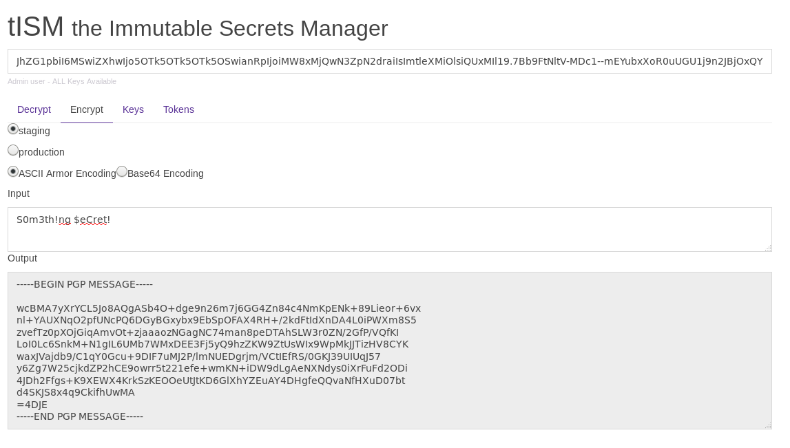

====================================
tISM - the Immutable Secrets Manager
====================================

.. image:: ttps://goreportcard.com/badge/github.com/deuscapturus/tism
   :alt: Go Report Card
   :target: https://goreportcard.com/report/github.com/deuscapturus/tism

.. image:: https://godoc.org/github.com/deuscapturus/tism?status.png
   :alt: GoDoc
   :target: https://godoc.org/github.com/deuscapturus/tism

tISM is PGP encryption-as-a-service for secrets management.  Decrypt/Encrypt PGP secrets via API with token authorization.

tISM solves the immutable infrastructure problem of secrets management.

.. contents::
    :local:
    
.. WARNING::

   Use at your own risk!

Features
========

* Does not store any secrets.
* Simple. No databases. The only persistent data is a pgp keyring and configuration file.
* Asymmetric encryption with secure and ubiquitous PGP/GPG.  Allows secrets to be encrypted with distributed public keys.
* Authorization with short lived and revocable JWT tokens.

Security
========

tISM relies on 3 separated components to access secrets.

1.  Access Token.
2.  PGP Encrypted Message
3.  tISM Server

Access Tokens are implemented with JSON Web Token https://tools.ietf.org/html/rfc7519
Message Encryption and Decryption is implemented with OpenPGP https://tools.ietf.org/html/rfc4880

Quick Start
===========

RPM
---

.. code::

  #Install
  sudo dnf install https://github.com/deuscapturus/tism/releases/download/0.0/tism-0.0-1.fc25.x86_64.rpm
  
  #Initialize
  sudo tism -t -c -n
  
  #Run
  sudo systemctl start tism

machinectl
----------

Run as a container with systemd-nspawn.  systemd-nspawn runs containers and ships with systemd.  So it is available on most Linux distributions without any further setup.

.. code::

  #Install
  sudo machinectl --verify=checksum pull-tar https://github.com/deuscapturus/tism/releases/download/0.0/tism-0.0.tgz
  
  #Initialize
  sudo systemd-nspawn -M tism-0.0 tism -t -c -n
  
  #Run
  sudo systemd-nspawn -M tism-0.0 tism

docker
------

Docker is annoyingly opinionated about forcing immutable containers.  As a result we have one additional step here.

.. code::

  #Install
  docker import -c 'EXPOSE 8080' https://github.com/deuscapturus/tism/releases/download/0.0/tism-0.0.tgz tism

  #Initialize
  docker run --name=tism tism tism -t -c -n

  #Generate new image from initialized container
  docker commit tism tism:initialized

  #Run
  docker run -d tism:initialized tism
  

Web UI  
======

To use the web ui your browser must have es6 module support enabled (a very new feature).

Currently Supported Browers:

- Firefox 54 or greater with `dom.moduleScripts.enabled`
- Safari 10.1 or greater

https://localhost:8080

API
===

`API Documentation <API.rst>`_
